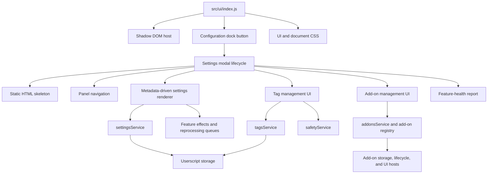

# High-Level Architecture

Layers:

- Bootstrap and host creation: Shadow DOM, styles, dock/button
- UI skeleton and lifecycle: modal injection, lifecycle bindings
- Metadata-driven rendering: metadata → controls → persistence/effects
- Feature/service integration: delegate domain work to services
